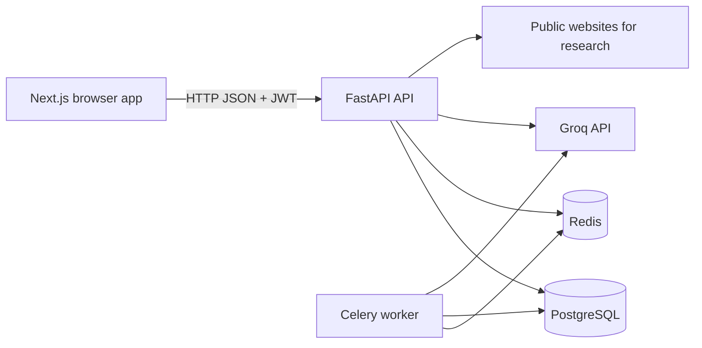
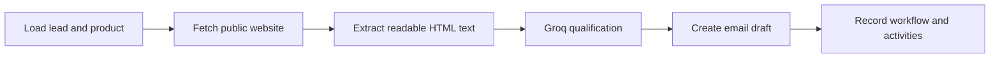

# AI Marketing Akademia: Architecture and Maintenance Guide

## 1. Purpose

AI Marketing Akademia is a two-sided application:

- A public marketing website for products and company content.
- An authenticated admin workspace for products, leads, campaigns, emails, content, automations, AI workflows, and operational tracking.

This document is for product owners, maintainers, developers, and operators. It explains what is live today, where the code lives, which environment variables are required, how the major workflows run, and which external integrations are still future work.

## 2. Current Capability Summary

| Capability | Current state |
|---|---|
| Admin authentication | Implemented with JWT (HS256, 30-min expiry) and bcrypt password hashing. |
| Password policy | Enforced: min 8 chars, uppercase, lowercase, digit required. |
| Login rate limiting | Implemented: 5 attempts per 5 minutes per IP address. |
| Product, lead, campaign, email, automation, and content CRUD | Implemented through FastAPI endpoints and admin forms. |
| Dashboard metrics | Calculated from database rows; no dashboard counters are hardcoded. |
| Demo data | Opt-in with `DEMO_DATA=true`; default is `false`. |
| Groq AI calls | Implemented for lead qualification, research, copy generation, and channel selection. |
| LangGraph workflow | Implemented for website research, lead qualification, and email draft creation. |
| Website research | Fetches public HTTP/HTTPS pages and extracts readable HTML text. |
| Workflow tracking | Implemented with workflow runs and append-only marketing activity records. |
| Email approval | Implemented. Drafts can be approved or rejected. |
| Email delivery | Not implemented. Email records and drafts are stored only. |
| Instagram publishing | Not implemented. Content generation exists; publishing is simulated. |
| LinkedIn publishing | Not implemented. Content generation exists; publishing is simulated. |
| Phone calls | Not implemented. No telephony provider is connected. |
| LinkedIn lead discovery | Not implemented. Current AI lead discovery creates synthetic candidates. |
| Website crawling | Not implemented. Only one supplied public URL is fetched. |

Important: the current marketing publishing task creates fake URLs and marks them as published. It does not call Instagram, LinkedIn, email, or any other external delivery API.

## 3. Security Controls

| Control | Implementation |
|---|---|
| JWT signing | HS256 with auto-generated 32+ char `SECRET_KEY` (never a default value) |
| Token expiry | 30 minutes (configurable via `ACCESS_TOKEN_EXPIRE_MINUTES`) |
| Password hashing | bcrypt via `passlib` |
| Password policy | Minimum 8 characters, requires uppercase, lowercase, and digit |
| Login rate limiting | 5 attempts per 300 seconds per IP (in-memory; use Redis for multi-process) |
| CORS | Restricted to configured origins; credentials disabled by default |
| Secrets management | `.env` files gitignored; `.env.example` contains placeholders only |
| Token storage | `sessionStorage` in frontend (not `localStorage`) |

## 4. System Architecture



### Runtime services

| Service | Default address | Responsibility |
|---|---:|---|
| Frontend | `http://localhost:3003` | Next.js public site and admin UI. |
| Backend | `http://localhost:8000` | FastAPI API, auth, CRUD, workflow triggers. |
| API docs | `http://localhost:8000/docs` | FastAPI Swagger/OpenAPI documentation. |
| PostgreSQL | Docker network `db:5432` | Persistent application data. |
| Redis | Docker network `redis:6379` | Celery broker and result backend. |
| Celery worker | No public port | Executes AI/content background tasks. |

## 5. Repository Map

### Backend

- [backend/app/main.py](../backend/app/main.py): FastAPI application, CORS, and router registration.
- [backend/app/core/config.py](../backend/app/core/config.py): Environment-backed settings.
- [backend/app/core/database.py](../backend/app/core/database.py): Async SQLAlchemy engine and database dependency.
- [backend/app/core/auth.py](../backend/app/core/auth.py): JWT creation/decoding and password hashing.
- [backend/app/core/init_db.py](../backend/app/core/init_db.py): Non-destructive schema creation and startup seeding.
- [backend/app/core/seed.py](../backend/app/core/seed.py): Optional demo fixtures and the development admin account.
- [backend/app/core/celery_app.py](../backend/app/core/celery_app.py): Celery configuration and task discovery.
- [backend/app/ai/groq_client.py](../backend/app/ai/groq_client.py): Async Groq client wrapper.
- [backend/app/services/research.py](../backend/app/services/research.py): Website research, LangGraph workflow, lead qualification, and email draft generation.
- [backend/app/services/tracking.py](../backend/app/services/tracking.py): Workflow run and activity audit helpers.
- [backend/app/tasks/automation.py](../backend/app/tasks/automation.py): AI lead discovery task.
- [backend/app/tasks/content.py](../backend/app/tasks/content.py): AI content generation, channel selection, and simulated publishing.
- [backend/app/api/routers/](../backend/app/api/routers): REST endpoints by resource.
- [backend/app/models/](../backend/app/models): SQLAlchemy database tables.
- [backend/app/schemas/](../backend/app/schemas): Pydantic request and response contracts.
- [backend/tests/](../backend/tests): Async API, workflow, tracking, and task tests.

### Frontend

- [frontend/src/app/(marketing)](../frontend/src/app/(marketing)): Public marketing pages.
- [frontend/src/app/admin](../frontend/src/app/admin): Protected admin workspace.
- [frontend/src/app/admin/_components/auth-context.tsx](../frontend/src/app/admin/_components/auth-context.tsx): Login, logout, token persistence, and `/auth/me` verification.
- [frontend/src/app/admin/_components/RequireAuth.tsx](../frontend/src/app/admin/_components/RequireAuth.tsx): Redirects unauthenticated users to `/admin/login`.
- [frontend/src/app/admin/_components/Sidebar.tsx](../frontend/src/app/admin/_components/Sidebar.tsx): Admin navigation.
- [frontend/src/lib/api.ts](../frontend/src/lib/api.ts): Shared HTTP API wrapper.
- [frontend/src/types/index.ts](../frontend/src/types/index.ts): TypeScript API models.
- [frontend/src/__tests__](../frontend/src/__tests__): Jest and Testing Library tests.

## 6. Configuration and Secrets

Copy the example file for local Docker use:

```bash
cp backend/.env.example backend/.env
```

Never commit `backend/.env`. It is ignored by Git. The tracked example must contain placeholders only.

### Required backend variables

| Variable | Required | Example/local value | Purpose |
|---|---:|---|---|
| `DB_USER` | Yes | `akademia` | PostgreSQL username. |
| `DB_PASSWORD` | Yes | `changeme` | PostgreSQL password. Use a strong secret outside local development. |
| `DB_NAME` | Yes | `akademia_db` | PostgreSQL database name. |
| `DB_HOST` | Yes | `db` in Docker | Database hostname. Use `localhost` only when running the backend outside Docker. |
| `DB_PORT` | Yes | `5432` in Docker | PostgreSQL port inside the Docker network. |
| `REDIS_HOST` | Yes for worker | `redis` in Docker | Redis hostname. |
| `REDIS_PORT` | Yes for worker | `6379` | Redis port. |
| `GROQ_API_KEY` | Required for AI features | Local secret | Groq authentication. |
| `SECRET_KEY` | No (auto-generated) | Leave empty or set a strong random value | JWT signing key. If empty, a random 32+ char key is generated at startup. Never use `change-me` in production. |
| `ALGORITHM` | Yes | `HS256` | JWT signing algorithm. |
| `CORS_ORIGINS` | Yes for browser calls | `["http://localhost:3003"]` | Allowed browser origins. |
| `DEMO_DATA` | Optional | `false` | When `true`, inserts demo products, leads, campaigns, emails, automations, and content. |
| `ACCESS_TOKEN_EXPIRE_MINUTES` | Optional | `30` | JWT token lifetime in minutes. |
| `RATE_LIMIT_ENABLED` | Optional | `true` | Enable or disable login rate limiting. |
| `RATE_LIMIT_LOGIN_ATTEMPTS` | Optional | `5` | Max login attempts before rate limiting. |
| `RATE_LIMIT_LOGIN_WINDOW_SECONDS` | Optional | `300` | Rate limit window in seconds. |
| `PASSWORD_MIN_LENGTH` | Optional | `8` | Minimum password length. |
| `PASSWORD_REQUIRE_UPPERCASE` | Optional | `true` | Require uppercase in passwords. |
| `PASSWORD_REQUIRE_LOWERCASE` | Optional | `true` | Require lowercase in passwords. |
| `PASSWORD_REQUIRE_DIGIT` | Optional | `true` | Require digit in passwords. |

### Frontend variables

The frontend defaults to:

```env
NEXT_PUBLIC_API_URL=http://localhost:8000/api
```

For local development, this default is sufficient. To override it, create `frontend/.env.local`:

```env
NEXT_PUBLIC_API_URL=http://localhost:8000/api
```

### API-key readiness matrix

| Provider | Current key needed? | Current use | Future work |
|---|---:|---|---|
| Groq | Yes for AI workflows | Real API calls from `groq_client.py`. | Add retries, structured validation, rate-limit handling, and model fallback. |
| PostgreSQL | Password required | Real persistent database. | Use managed PostgreSQL and secret storage in production. |
| Redis | No API key, local connection | Celery broker/result backend. | Use secured managed Redis in production. |
| Email provider | No current key | No real sending occurs. | Add SMTP, Resend, SendGrid, or Mailgun adapter and webhook handling. |
| LinkedIn | No current key | Content generation only; publishing is simulated. | Add approved OAuth/API integration. |
| Instagram/Meta | No current key | Caption and hashtag generation only. | Add Meta Graph API, Business account, OAuth, and media publishing. |
| Twilio or telephony provider | No current key | No calls are made. | Add call request, status webhook, consent, and recording policy. |
| Search provider | No current key | No search engine lookup. | Add a compliant search API for real lead research. |

## 7. Developer Onboarding

### What a developer needs

| Requirement | Details |
|---|---|
| **Python 3.11+** | Backend runs on Python 3.11. Use `pyenv` or `python3.11` explicitly. |
| **Node.js 18+** | Frontend requires Node 18+ for Next.js 16. |
| **Docker & Docker Compose** | Easiest way to run the full stack. |
| **Groq API key** | Required for all AI features. Get one at [groq.com](https://groq.com). |
| **Git** | Clone the repository. |

### Quick start

```bash
# 1. Clone
git clone https://github.com/AkademiaLimited/AI-Marketing-Akademia.git
cd AI-Marketing-Akademia

# 2. Set up backend
cd backend
cp .env.example .env
# Edit .env: set GROQ_API_KEY, DB_PASSWORD, and optionally SECRET_KEY
python -m venv .venv
source .venv/bin/activate
pip install -r requirements.txt

# 3. Set up frontend
cd ../frontend
npm install
# Optionally create .env.local to override NEXT_PUBLIC_API_URL

# 4. Run the full stack (from repo root)
docker compose up --build
```

### API keys and secrets summary

| Secret | Where set | Required for | Where documented |
|---|---|---|---|
| `GROQ_API_KEY` | `backend/.env` | All AI workflows (research, qualification, content generation) | Section 6 |
| `DB_PASSWORD` | `backend/.env` | Database access | Section 6 |
| `SECRET_KEY` | `backend/.env` (optional) | JWT signing. Auto-generated if empty. | Section 6 |
| `NEXT_PUBLIC_API_URL` | `frontend/.env.local` (optional) | Frontend API endpoint. Defaults to `http://localhost:8000/api`. | Section 6 |

**Important:** Never commit `backend/.env` or `frontend/.env.local`. The tracked `backend/.env.example` must contain placeholders only. Never place real API keys in `.env.example`, frontend code, tests, or documentation.

## 8. Startup and Operations

### Backend only, with logs visible

From the repository root:

```bash
docker compose up -d db redis
docker compose up --build --force-recreate backend
```

The second command stays attached and shows backend logs. For a separate log view:

```bash
docker compose logs -f backend
```

The backend startup command is defined in [docker-compose.yml](../docker-compose.yml):

```text
python -m app.core.init_db && uvicorn app.main:app --host 0.0.0.0 --port 8000
```

`init_db.py` creates missing tables, waits for PostgreSQL with retries, inserts the admin account, and only inserts demo data when `DEMO_DATA=true`. It does not drop the schema.

### Full Docker stack

```bash
docker compose up --build
```

This starts database, Redis, backend, worker, and frontend.

### Stop services

```bash
docker compose down
```

To delete local database and Redis volumes, which destroys local data:

```bash
docker compose down -v
```

### Health check

```bash
curl http://localhost:8000/health
```

Expected:

```json
{"status":"ok"}
```

## 9. Authentication

### Development admin credentials

Created by `seed_users()` in [seed.py](../backend/app/core/seed.py):

```text
Email:    admin@akademia.local
Password: Admin@1234
```

These are development credentials only. Change the seed strategy and password handling before production.

### Login flow

1. Frontend sends `POST /api/auth/login` as form data.
2. Backend checks rate limiting (5 attempts per 5 minutes per IP).
3. Backend verifies the bcrypt password hash.
4. Backend returns a JWT (30-minute expiry).
5. Frontend stores the token in `sessionStorage` under `admin_token`.
6. Frontend calls `GET /api/auth/me` to verify the user and `is_superuser` flag.
7. Protected admin pages redirect to `/admin/login` when verification fails.

### Registration

`POST /api/auth/register` accepts email, name, and password. Passwords must meet the policy (min 8 chars, uppercase, lowercase, digit). Registered users are not admins by default.

### Protected routes

All admin routes require a valid JWT and `is_superuser=True`. The dependency chain is:
- `get_current_user` validates the JWT and loads the user
- `get_current_admin` additionally checks `is_active` and `is_superuser`

## 10. API Surface

All routes are registered in [main.py](../backend/app/main.py). Most admin routes require a bearer JWT and superuser access.

| Prefix | Purpose | Main write operations |
|---|---|---|
| `/api/auth` | Login, registration, current user | `POST /login`, `POST /register` |
| `/api/dashboard` | Live lead status summary | Read only |
| `/api/products` | Product management and marketing trigger | `POST /`, `PATCH /{slug}`, `POST /{slug}/publish` |
| `/api/leads` | Lead management | `POST /`, `PATCH /{id}/status`, `POST /{id}/research-email` |
| `/api/campaigns` | Campaign records | `POST /` |
| `/api/emails` | Email drafts and approval | `POST /`, `POST /{id}/approve`, `POST /{id}/reject` |
| `/api/automations` | Automation records | `POST /`, `PATCH /{id}` |
| `/api/content` | Content records | `POST /`, `PATCH /{id}` |
| `/api/workflows` | Workflow and activity audit reads | `GET /runs`, `GET /activities` |
| `/api/contact` | Public contact form | `POST /` |

## 11. Admin User Workflows

### Create a product and start AI marketing

1. Open Admin -> Products.
2. Select `Create product`.
3. Enter product name, slug, problem, target, description, category, and price.
4. Save. The product is persisted through `POST /api/products/`.
5. Select `Publish to Marketing`.
6. The backend marks the product as queued and submits a Celery chain:
   - `generate_content`
   - `select_channels`
   - `publish_content`
7. The worker calls Groq for platform-specific copy.
8. Channel selection uses category rules or a Groq estimate.
9. Current final publishing is simulated and written to `publish_logs`.

### Add a lead and research it

1. Open Admin -> Leads.
2. Select `Add lead` and save the real company/contact data.
3. Call `POST /api/leads/{id}/research-email` from an approved future UI action or API client.
4. The LangGraph workflow runs:



5. The website URL, activity status, qualification reason, workflow ID, and draft email are stored.
6. The email remains `draft`; it is not sent.

### Review an email

1. Open Admin -> Emails.
2. Select `Create draft` for a manually written draft, or use a generated draft.
3. Select `Approve` or `Reject`.
4. Only `draft` records can transition to `approved` or `rejected`.
5. Approval currently does not send an email. A real provider must be added before `approved` can become `sent`.

### Create campaign or automation

Campaigns and automations currently create database records and display them in the admin UI. They do not yet execute a real sequence or scheduled recurring job.

## 12. AI and LangGraph Design

### Groq wrapper

[groq_client.py](../backend/app/ai/groq_client.py) exposes:

- `call_groq()` for text output.
- `call_groq_json()` for JSON output.

The current model is configured in the function defaults as `openai/gpt-oss-120b` through Groq.

### LangGraph workflow

[research.py](../backend/app/services/research.py) compiles a `StateGraph` with these nodes:

1. `load_context`: loads the lead and associated product.
2. `research_website`: fetches and parses a public website.
3. `qualify_and_draft`: asks Groq for score, reasoning, subject, and body.
4. `persist_draft`: stores the reasoning and email draft.

Each node records a stage-specific error when it fails:

- `load_context_failed`
- `research_website_failed`
- `ai_qualification_failed`
- `email_draft_persistence_failed`
- `workflow_failed`

The implementation protects against local URLs such as `localhost` and `127.0.0.1`, but production SSRF protection should also validate private IP ranges after DNS resolution and enforce response-size/content-type limits.

## 13. Tracking and Auditability

The tracking foundation is in:

- [backend/app/models/workflow.py](../backend/app/models/workflow.py)
- [backend/app/services/tracking.py](../backend/app/services/tracking.py)
- [backend/app/api/routers/workflows.py](../backend/app/api/routers/workflows.py)

### Workflow runs

`workflow_runs` stores:

- Workflow type
- Lead ID
- Running/completed/failed status
- Start and finish timestamps
- Overall error

### Marketing activities

`marketing_activities` stores:

- Workflow ID
- Lead and email IDs
- Activity type
- Channel
- Website source URL
- Status
- Details
- Error cause
- Timestamp

The Admin -> Automation page shows recent activity and failure causes.

When real providers are implemented, every provider request should create an activity before the request and update it with the provider result, provider message ID, response status, and error details. Never mark an action `sent` or `published` before the provider confirms success.

## 14. Database and Seed Behavior

SQLAlchemy models are in [backend/app/models](../backend/app/models). Tables are created by `Base.metadata.create_all()` during local startup. There is currently no production migration workflow in the repository; schema evolution should move to Alembic migrations before production deployment.

`DEMO_DATA=false` is the default. This stops new demo rows from being inserted, but it does not delete existing rows from a previously seeded database. To reset local data deliberately:

```bash
docker compose down -v
docker compose up -d db redis
docker compose up --build backend
```

The `-v` option is destructive and should never be used against production data.

## 15. Testing and Quality Gates

### Backend

```bash
cd backend
.venv/bin/python -m pytest -q
```

The backend tests cover:

- API contracts
- Auth and local development email serialization
- Password policy enforcement (min length, uppercase, lowercase, digit)
- Login rate limiting (blocks after max attempts, window behavior)
- Secret key strength (not default, random, sufficient length)
- Password hashing and verification
- Lead discovery
- Content generation and channel selection
- LangGraph website research
- Workflow tracking and failure causes
- Email approval/rejection

### Frontend

```bash
cd frontend
npm test -- --runInBand
npm run build
```

Frontend tests cover public pages, admin pages, login, products, emails, leads, campaigns, automations, dashboard, content, API helpers, and contact flows.

### Current expected warnings

The test suites may show dependency deprecation warnings from pytest-asyncio, Starlette, Passlib, or LangGraph. These warnings do not currently fail the suites. The Next.js build may warn about multiple lockfiles and workspace-root inference; clean that up before CI/CD standardization.

## 16. External Integration Roadmap

The safe order for real automation is:

1. Add provider interfaces and a dry-run provider.
2. Add a real transactional email provider.
3. Add approval enforcement before any external send.
4. Add delivery webhooks and provider message IDs.
5. Add LinkedIn official API/OAuth integration.
6. Add Meta Graph API for Instagram Business/Creator publishing.
7. Add compliant search and website research providers.
8. Add Twilio or another telephony provider with consent and webhook tracking.
9. Add scheduled Celery Beat workflows.
10. Add retry policies, rate limits, idempotency keys, opt-out handling, and provider-specific audit records.

Do not implement direct LinkedIn or Instagram scraping. Use their approved APIs and respect platform terms. Do not allow an AI agent to send messages automatically without approval, consent, rate limits, and an auditable provider response.

## 15. Maintenance Rules

- Keep secrets in ignored environment files or a production secret manager.
- Never place API keys in `.env.example`, frontend code, tests, or documentation.
- Do not mutate existing primary keys during seed or startup reconciliation.
- Keep demo data opt-in.
- Add a backend test and frontend test for every new admin workflow.
- Run the complete backend suite and frontend suite after changes.
- Run a production frontend build before merging UI changes.
- Record every external attempt in `marketing_activities`.
- Keep simulated provider behavior clearly labeled until a real provider is connected.
- Add an Alembic migration before changing production database schemas.
